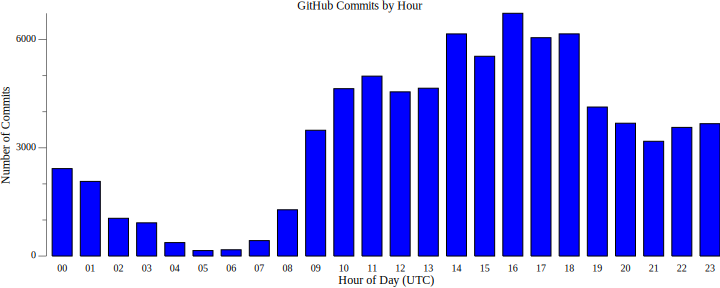

# GitHub Graph Commit Times


### [View all Roadmaps](https://github.com/nholuongut/all-roadmaps) &nbsp;&middot;&nbsp; [Best Practices](https://github.com/nholuongut/all-roadmaps/blob/main/public/best-practices/) &nbsp;&middot;&nbsp; [Questions](https://www.linkedin.com/in/nholuong/)
<br/>

This Golang program generates a graphical representation (SVG) of commit activity by hour for any number of GitHub
repositories.

It can also filter commits by a specific user or email.

There is also a similar version in Bash in the
[nholuongut/devops-bash-tools](https://github.com/nholuongut/devops-bash-tools) repo.

<!-- INDEX_START -->

- [GitHub Graph Commit Times](#github-graph-commit-times)
- [Features](#features)
- [Run](#run)
- [Build](#build)
  - [Run Binary](#run-binary)
- [Result](#result)
- [Caveats](#caveats)
  - [GitHub API returns Times in UTC](#github-api-returns-times-in-utc)
- [More Core Repos](#more-core-repos)
  - [Knowledge](#knowledge)
  - [DevOps Code](#devops-code)
  - [Containerization](#containerization)
  - [CI/CD](#cicd)
  - [DBA - SQL](#dba---sql)
  - [DevOps Reloaded](#devops-reloaded)
  - [Misc](#misc)

<!-- INDEX_END -->

## Features

- Fetch commits from multiple GitHub repositories
- Visualize commits by hour (0-23)
- Option to filter commits by username or email
- Saves output as an SVG graph

## Run

```shell
go run main.go <username>
```

eg.

```shell
go run main.go nholuongut
```

## Build

To compile a portable binary:

```shell
make build
```

### Run Binary

Will fetch all public non-fork repos and for each one the commit log to generate the commits for the graph.

```shell
./github-graph-commit-times nholuongut
```

## Result

`graph.svg`:



## Caveats

### GitHub API returns Times in UTC

...and there is no way to know the original timezone of the programmer this way.

Scripts `git/git_graph_commit_times_*.sh` that generate graphs from local git repo checkouts in the
[DevOps-Bash-tools](https://github.com/nholuongut/devops-bash-tools) repo will get local timezone hours from the local
`git log` in each checkout, but this only works if you have all the repos checked out locally so requires much more
admin than querying the GitHub API.

# 🚀 I'm are always open to your feedback.  Please contact as bellow information:
### [Contact ]
* [Name: nho Luong]
* [Skype](luongutnho_skype)
* [Github](https://github.com/nholuongut/)
* [Linkedin](https://www.linkedin.com/in/nholuong/)
* [Email Address](luongutnho@hotmail.com)
* [PayPal.me](https://www.paypal.com/paypalme/nholuongut)


[](https://ko-fi.com/nholuong)

# License
* Nho Luong (c). All Rights Reserved.🌟